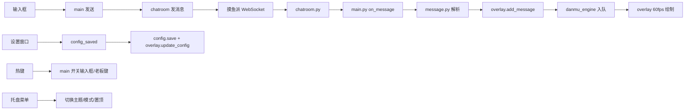

# 弹幕鱼排

弹幕鱼排（danmuFishpi）是一个在 Windows 桌面上显示 [fishpi](https://fishpi.cn) 聊天室弹幕的透明悬浮窗应用。它基于 PyQt6 绘制，覆盖在所有窗口之上，**穿透鼠标点击**，方便工作娱乐时同步看到聊天消息。

## 主要功能

- **透明弹幕悬浮窗**：全局置顶、穿透鼠标点击，不干扰正常操作。
- **两种显示模式**：滚动弹幕（从右向左）与浮动卡片浮窗，可在托盘菜单或设置中一键切换。
- **自动登录**：首次登录后账号信息会加密保存到本地，下次启动自动连接聊天室。
- **全局快捷键**：默认按 `F9` 呼出输入框，再按一次即可关闭；支持键盘组合与鼠标侧键。
- **消息过滤与关注**：支持屏蔽指定用户、隐藏红包消息、特别关注提醒。
- **浅色 / 深色主题**：可在托盘菜单一键切换（切换主题时不再覆盖当前显示模式）。
- **字号可调**：滚动与浮动模式字号均支持 8–48 px 范围调整。
- **图片与头像 / GIF**：自动加载用户头像、消息中的图片与 GIF 动图。

## 运行环境

- Windows 10 / 11（依赖 Windows DPAPI 加密密码）
- Python 3.10 或更高版本

## 技术栈

- **Python 3** + **PyQt6**：GUI、透明窗口、系统托盘、设置面板
- **WebSocket**：客户端连接摸鱼派聊天室（见 `chatroom.py`）

- **Win32 API（ctypes）**：鼠标穿透 + 强制置顶（`win32_overlay.py`）
- **Windows DPAPI**：本地加密保存账号密码（`auth.py`）
- **PyInstaller**：打包成单文件 exe（`build_exe.py` / `弹幕鱼排.spec`）

## 架构与核心数据流



## 模块总览

| 文件 | 职责 |
| --- | --- |
| `main.py` | 程序入口与总编排：创建各组件并接好回调（最大模块） |
| `config.py` | 配置 dataclass + 读写 + DPAPI 加解密 |
| `chatroom.py` | 摸鱼派 WebSocket 客户端（连接 / 鉴权 / 收消息 / 心跳 / 重连 / 发消息） |
| `auth.py` | 登录拿 token、密码加解密 |
| `message.py` | 消息解析（HTML、图片、红包、@、代码块） |
| `danmu_engine.py` | 弹幕数据模型与运动逻辑（滚动 / 浮动） |
| `overlay.py` | 透明悬浮窗与渲染（最核心的绘制逻辑） |
| `tray.py` | 系统托盘菜单 |
| `input_box.py` | 底部输入条 |
| `settings_window.py` | 设置对话框（四个 Tab：账号 / 显示 / 热键 / 屏蔽关注） |
| `hotkey.py` | 全局热键管理（键盘组合 + 鼠标侧键，含占用回退键位） |
| `notification.py` | 系统通知 / 特别关注提醒 |
| `image_cache.py` | 头像 / 图片 / GIF 异步下载与缓存 |
| `win32_overlay.py` | Win32 扩展样式、置顶重设、独占全屏探测 |

## 两种显示模式

| | 滚动模式 | 浮动模式 |
| --- | --- | --- |
| 表现 | 弹幕从右向左飞过 | 屏幕四角的圆角卡片，停留几秒后淡出 |
| 区域 | 全屏 / 上半屏 / 下半屏可选 | 四角任选（topLeft / topRight / bottomLeft / bottomRight） |
| 可调项 | 速度、宽、高、透明度、字号、顶部边距 | 停留时长、最大条数、卡片宽度、卡片字号 |
| 引擎 | `scroll_items` + `update_scrolling` | `float_items` + `cleanup_floating` |

切换入口：设置窗口单选、托盘「模式」子菜单、主题切换时保留当前模式。

## 开发环境搭建

1. 进入项目目录。

2. 创建并激活虚拟环境（可选但推荐）：

   ```powershell
   python -m venv .venv
   .venv\Scripts\Activate.ps1
   ```

3. 安装依赖：

   ```powershell
   pip install -r requirements.txt
   ```

4. 启动程序：

   ```powershell
   python main.py
   ```

   也可双击 `run.bat` 启动。

## 使用方法

### 首次登录

1. 启动程序后，屏幕不会出现明显窗口，但系统托盘会出现一条蓝色小鱼图标。
2. 右键托盘图标，选择「设置」。
3. 在设置面板输入 fishpi 账号和密码，点击登录。
4. 登录成功后，弹幕悬浮窗会自动接收聊天室消息。

### 发送消息

- 按下全局快捷键（默认 `F9`）调出底部输入框，再按一次关闭；输入内容后回车发送。
- 如果 `F9` 被其他软件占用，程序会自动尝试 `Ctrl+Shift+Enter` 等备选快捷键。
- 也可以右键托盘图标，选择「发送消息」手动打开输入框。

### 托盘菜单说明

| 菜单项 | 作用 |
| --- | --- |
| 打开设置 | 打开登录和显示设置 |
| 发送消息 | 打开消息输入框 |
| 显示 / 隐藏弹幕 | 临时开关弹幕层 |
| 强制置顶 | 如果弹幕被全屏游戏覆盖，点此重新置顶 |
| 主题 | 子菜单，在黑夜 / 白天模式之间切换 |
| 模式 | 子菜单，在滚动 / 浮动模式之间切换 |
| 退出 | 关闭程序并断开聊天室连接 |

### 设置项说明

- **显示模式**：滚动弹幕或浮动卡片；浮动模式可停靠屏幕四个角，并可设置停留时长、最大条数、卡片宽度与卡片字号。
- **显示头像 / 昵称 / 图片**：控制弹幕中是否显示对应元素。
- **显示红包**：关闭后将过滤聊天室中的红包消息。
- **弹幕速度**：1 到 10，数值越大滚动越快（滚动模式）。
- **显示区域**：可选全屏、上半屏或下半屏（滚动模式）。
- **字号**：滚动与浮动字号均在 8–48 px 范围内可调。
- **透明度 / 字体 / 描边 / 顶部边距**：按个人喜好调整可读性。
- **特别关注 / 屏蔽用户**：填写 fishpi 用户 ID。

## 打包成 EXE

项目使用 **PyInstaller** 打包成单个可执行文件，方便在没有 Python 环境的电脑上运行。

### 1. 安装 PyInstaller

在虚拟环境中执行：

```powershell
pip install pyinstaller
```

### 2. 执行打包命令

```powershell
python build_exe.py
```

如需调试版（带控制台输出），改用：

```powershell
python build_exe_debug.py
```

也可直接用 PyInstaller 命令（构建配置见 `弹幕鱼排.spec`）：

```powershell
pyinstaller --noconfirm --onefile --windowed --name "弹幕鱼排" main.py
```

参数说明：

- `--onefile`：打包成单个 `.exe` 文件。
- `--windowed`：不显示命令行窗口。
- `--name`：生成的可执行文件名称。

### 3. 减小体积（可选）

PyInstaller 默认会把 PyQt6 等依赖完整打包，单文件体积通常超过 50 MB。可以改用以下命令，让可执行文件依赖一个独立的 `_internal` 目录，体积更合理：

```powershell
pyinstaller --noconfirm --windowed --name "弹幕鱼排" main.py
```

### 4. 找到输出文件

打包完成后，产物位于：

```text
dist\弹幕鱼排.exe
```

直接运行该文件即可。首次运行仍会提示登录，之后自动连接。

> `dist/` 与 `build/` 已被 `.gitignore` 忽略，exe 不会进入版本库；对外发布时将其作为 GitHub Release 的附件上传即可。

## 常见问题
 
- **托盘找不到图标**：图标可能被折叠在系统托盘的展开区域里。
- **全屏游戏看不到弹幕**：某些独占全屏游戏会覆盖桌面层
- **快捷键失效**：在设置中换一个未被占用的组合键，例如 `Ctrl+Alt+M`。
- **登录失败**：检查网络能否访问 `https://fishpi.cn`，并确认账号密码正确。

## 目录结构

```text
.
├── main.py              # 程序入口，总编排各组件与事件循环
├── config.py            # 配置保存与 DPAPI 加密
├── chatroom.py          # WebSocket 聊天室连接
├── auth.py              # fishpi 登录与密码加解密
├── message.py           # 消息内容解析
├── danmu_engine.py      # 弹幕动画与轨道计算（滚动 / 浮动）
├── overlay.py           # 透明悬浮窗绘制
├── tray.py              # 系统托盘菜单
├── input_box.py         # 发送消息输入框
├── settings_window.py   # 设置界面（四 Tab）
├── hotkey.py            # 全局快捷键
├── notification.py      # 系统通知 / 关注提醒
├── image_cache.py       # 头像 / 图片 / GIF 缓存
├── win32_overlay.py     # Win32 扩展样式与置顶封装
├── build_exe.py         # PyInstaller 打包脚本（正式）
├── build_exe_debug.py   # PyInstaller 打包脚本（调试）
├── 弹幕鱼排.spec         # PyInstaller 构建配置
├── requirements.txt     # Python 依赖
├── run.bat              # 一键启动
└── README.md            # 本文件
```
